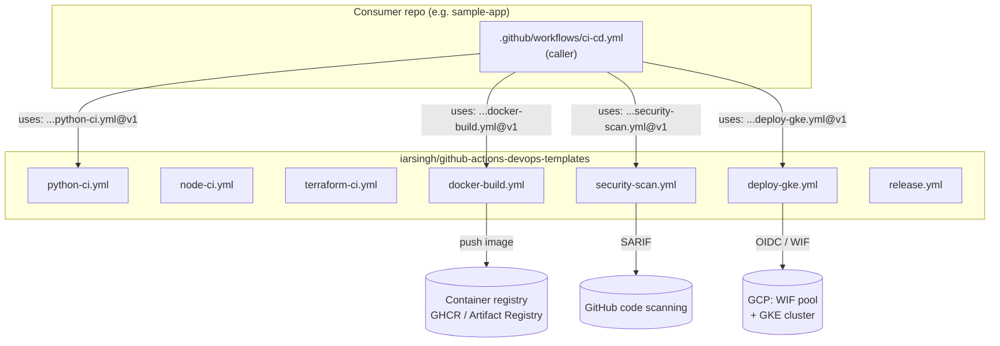
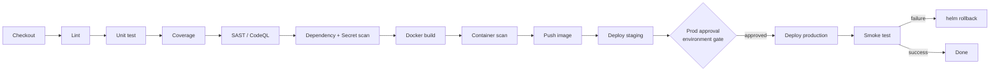
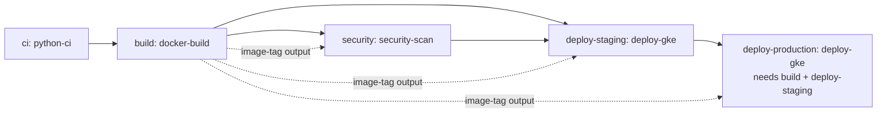

# Architecture

This repository is a **library of GitHub Actions reusable workflows** (`on: workflow_call`).
Application and infrastructure repositories across the org do **not** copy pipeline YAML;
they *call into* these workflows with a small `with:` / `secrets:` block. One place to fix,
one place to harden, one place to upgrade an action version.

## How a downstream repo calls in



Consumers pin to a **floating major tag** (`@v1`) for automatic non-breaking updates, or to
`@main` for bleeding edge, or to an immutable `@v1.4.0` for maximum reproducibility.

## Full stage pipeline (chained via `needs:`)



## Job dependency graph in `examples/app-ci-cd.yml`



## Design decisions

| Decision | Rationale |
| --- | --- |
| Reusable workflows over composite actions | Reusable workflows can define whole jobs, matrices, and their own permissions; composite actions run inside a single job's step list. |
| OIDC / Workload Identity Federation | No long-lived cloud keys stored as GitHub secrets. |
| Inputs have sane defaults | A consumer can adopt a workflow with a two-line call and override only what differs. |
| Outputs on `docker-build` | Downstream `security-scan` / `deploy-gke` consume the exact built `image-tag`, avoiding tag drift between build and deploy. |
| `fail-fast: false` on matrices | One interpreter/runtime failure still lets the rest report. |
| Rollback guarded by `steps.deploy.outcome == 'success'` | Only roll back when a previous good revision actually exists. |
| Pinned action versions + Dependabot | Reproducible runs, with a managed upgrade path. |

## Repository layout

```
.github/workflows/   # the 7 reusable workflows (the product)
examples/            # caller workflows a consumer copies into their repo
docs/                # per-workflow contracts + pipeline-stages.md
scripts/             # validate-workflows.sh, bump-release.sh
tests/               # shell-logic tests for bump-release
Makefile             # make lint / make test / make fmt
.github/dependabot.yml
```
