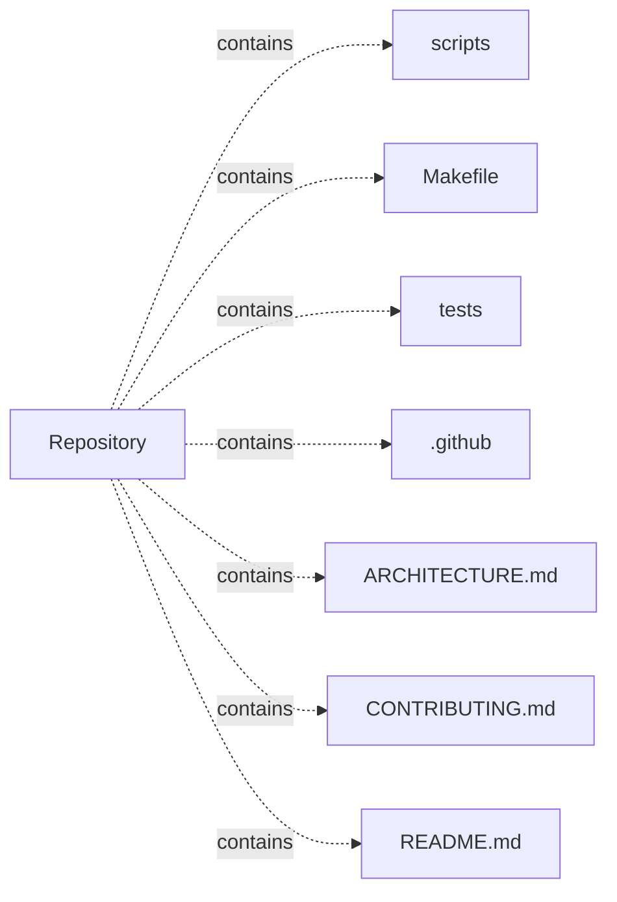
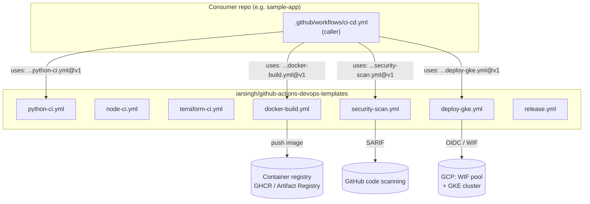

# github-actions-devops-templates — project architecture

[README](README.md) · [Interview questions and answers](INTERVIEW_QA.md)

## Purpose and scope

Reusable GitHub Actions workflows for CI, security scanning, container builds, GKE deployments, releases, and rollback.

This document describes files and symbols in this checkout. Deployment templates and statements in the original overview are distinguished from a verified running environment.

## Component diagram

For Python repositories, arrows show resolved local imports, not network calls or deployment order. Otherwise the diagram is a repository component map; containment arrows do not assert runtime integration.

## Components and responsibilities

| Component | Responsibility |
| --- | --- |
| [`scripts/bump-release.sh`](scripts/bump-release.sh) | Implementation or supporting configuration |
| [`scripts/validate-workflows.sh`](scripts/validate-workflows.sh) | Implementation or supporting configuration |
| [`Makefile`](Makefile) | Implementation or supporting configuration |
| [`tests/bump-release_test.sh`](tests/bump-release_test.sh) | Executable checks and regression examples |
| [`.github/workflows/deploy-gke.yml`](.github/workflows/deploy-gke.yml) | GitHub Actions job definitions |
| [`.github/workflows/docker-build.yml`](.github/workflows/docker-build.yml) | GitHub Actions job definitions |
| [`ARCHITECTURE.md`](ARCHITECTURE.md) | Project explanations or operating notes |
| [`CONTRIBUTING.md`](CONTRIBUTING.md) | Project explanations or operating notes |
| [`README.md`](README.md) | Project explanations or operating notes |

## Existing design and operating guides

These checked-in guides provide the project’s detailed design, operational context, or deployment view:

- [`ARCHITECTURE.md`](ARCHITECTURE.md).
- [`SECURITY.md`](SECURITY.md).
- [`docs/security-scan.md`](docs/security-scan.md).

### Existing deployment/design view

The following view is retained from [`ARCHITECTURE.md`](ARCHITECTURE.md). Read that guide for its assumptions and the distinction between configured and deployed components.

## Setup and verification

Follow the existing README and the component-specific instructions linked above. No new application start command is asserted for this repository.

Test entry points: [`tests/bump-release_test.sh`](tests/bump-release_test.sh).

Automation definitions: [`.github/workflows/deploy-gke.yml`](.github/workflows/deploy-gke.yml), [`.github/workflows/docker-build.yml`](.github/workflows/docker-build.yml), [`.github/workflows/node-ci.yml`](.github/workflows/node-ci.yml), [`.github/workflows/python-ci.yml`](.github/workflows/python-ci.yml), [`.github/workflows/release.yml`](.github/workflows/release.yml), [`.github/workflows/security-scan.yml`](.github/workflows/security-scan.yml). Read their triggers and job steps to determine what CI actually runs.

## Operating boundaries and design review

Before turning this checkout into a customer deployment, establish the input contract, data ownership, access controls, failure response, evaluation criteria, and rollback owner. Repository fixtures and unit tests demonstrate local behavior; they do not establish throughput, uptime, compliance, or business impact.

A useful architecture review starts with the linked implementation: identify where input enters, where a decision is made, which state can change, and which external dependency can fail. Add a deployment view only for infrastructure that is actually configured and exercised.
