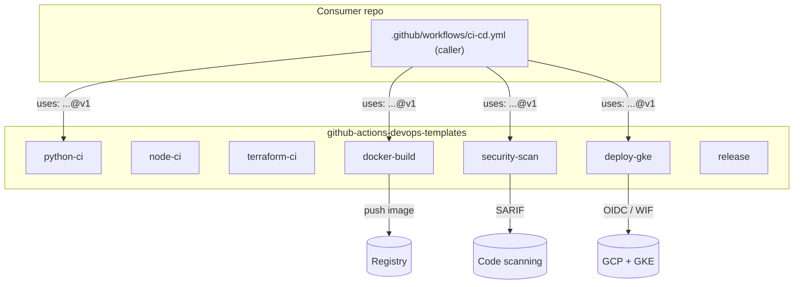

# Reusable CI/CD Pipeline Library

<!-- repository-summary -->
Reusable GitHub Actions workflows for CI, security scanning, container builds, GKE deployments, releases, and rollback.
<!-- /repository-summary -->

A library of **GitHub Actions reusable workflows** (`on: workflow_call`) that application
and infrastructure repositories across an organization call into for CI, security scanning,
container builds, GKE deployment, and releases — with sane defaults, explicit input/secret
contracts, OIDC cloud auth, caching, matrix testing, and automatic rollback on failure.

> **Status / honesty note.** These are real, syntactically valid, actionlint-clean reusable
> workflows. They have **not** been executed against a live GitHub Actions run with a real
> GCP project / GKE cluster in this repo — no OIDC/WIF is wired here. The YAML is correct and
> `examples/` shows exactly how a consumer wires and calls each workflow. Nothing here is
> "tested in production"; it is production-**shaped**.

---

## 1. Business problem

When every service repo owns its own copy of pipeline YAML, you get:

- **Duplication & drift** — 40 repos, 40 slightly different `ci.yml` files. A fix in one
  never reaches the others.
- **Inconsistent security posture** — some repos run Trivy, some run CodeQL, some run
  neither. Coverage is accidental, not guaranteed.
- **Slow, error-prone upgrades** — bumping an action version or changing the cache strategy
  means 40 PRs.
- **Copy-paste secrets/permissions mistakes** — over-broad `permissions:` and long-lived
  cloud keys spread by copy-paste.

A **shared reusable-workflow library** solves this: pipeline logic lives once, is versioned,
and consumers call it with a few lines. Security scanning, OIDC auth, caching, and rollback
become defaults every repo inherits instead of choices every team re-makes.

## 2. Architecture

Consumers keep a tiny caller workflow; the heavy lifting lives here and is pinned by tag.



See [ARCHITECTURE.md](ARCHITECTURE.md) for the full stage graph and job-dependency diagrams.

## 3. Technology stack

| Area | Tools |
| --- | --- |
| Orchestration | GitHub Actions **reusable workflows** (`workflow_call`) |
| Cloud auth | **OIDC / Workload Identity Federation** (`google-github-actions/auth`) |
| Build | Docker **Buildx** + GHA layer cache, `docker/build-push-action` |
| Deploy | **Helm** on **GKE** (`gke-gcloud-auth-plugin`, `get-gke-credentials`) |
| SAST | **CodeQL** |
| Vulnerabilities | **Trivy** (filesystem + image) |
| Secrets | **Gitleaks** |
| IaC scanning | **Checkov** / **tfsec** |
| Lint | ruff/flake8 (Python), eslint (Node), `terraform fmt` + **tflint** |
| Releases | Conventional Commits → semver tag → GitHub Release |
| Supply chain | **Dependabot** (github-actions, pip, npm, terraform, docker) |
| Local validation | **actionlint** (+ Python YAML fallback) |

## 4. Repository structure

```
.github/workflows/
  python-ci.yml      node-ci.yml       terraform-ci.yml
  docker-build.yml   security-scan.yml deploy-gke.yml     release.yml
.github/dependabot.yml
examples/            # caller workflows (python-app-ci, node-app-ci, terraform-infra-ci,
                     #                    app-ci-cd chained pipeline, release)
docs/                # one contract doc per workflow + pipeline-stages.md
scripts/             # validate-workflows.sh, bump-release.sh
tests/               # bump-release_test.sh
Makefile  ARCHITECTURE.md  SECURITY.md  CONTRIBUTING.md  LICENSE
```

## 5. Local setup

```bash
# Validate all workflow YAML (uses actionlint if present, else a Python fallback)
make lint

# Install actionlint locally, then lint with it
make install-actionlint
export PATH="$PWD/bin:$PATH"
make lint

# Quick YAML parse sanity check + script tests
make fmt
make test
```

`make lint` runs [`scripts/validate-workflows.sh`](scripts/validate-workflows.sh), which
prefers `actionlint` and otherwise parses every workflow with PyYAML and checks that each
reusable workflow declares `on.workflow_call`.

## 6. Cloud wiring — how a consumer connects OIDC/WIF and calls `deploy-gke.yml`

One-time setup on the GCP side (Terraform or `gcloud`):

1. Create a **Workload Identity Pool** and a **Provider** for GitHub's OIDC issuer
   (`https://token.actions.githubusercontent.com`).
2. Add an attribute condition binding the provider to your repo, e.g.
   `attribute.repository == 'iarsingh/sample-app'`.
3. Create a **deploy-only** service account (`roles/container.developer`) and allow the WIF
   principal to impersonate it (`roles/iam.workloadIdentityUser`).

Then the consumer's caller grants `id-token: write` and calls the workflow:

```yaml
permissions:
  contents: read
  id-token: write

jobs:
  deploy:
    uses: iarsingh/github-actions-devops-templates/.github/workflows/deploy-gke.yml@v1
    with:
      environment: production
      gcp-workload-identity-provider: projects/123/locations/global/workloadIdentityPools/github-pool/providers/github-provider
      gcp-service-account: gke-deployer@my-project.iam.gserviceaccount.com
      gcp-project-id: my-project
      cluster-name: platform-production
      cluster-location: europe-west1
      release-name: sample-app
      chart-path: ./charts/sample-app
      namespace: sample-app
      image: ghcr.io/iarsingh/sample-app:sha-abc123
      health-check-url: https://sample-app.example.com/healthz
```

No static keys are stored anywhere. See [SECURITY.md](SECURITY.md).

## 7. CI/CD flow

Full stage order (see [docs/pipeline-stages.md](docs/pipeline-stages.md)):

```
Checkout → Lint → Unit test → Coverage → SAST → Dependency scan
  → Docker build → Container scan → Push image → Deploy → Smoke test → Rollback on failure
```

Chained end-to-end in [`examples/app-ci-cd.yml`](examples/app-ci-cd.yml):

```
ci (python-ci) → build (docker-build) → security (security-scan)
              → deploy-staging (deploy-gke) → deploy-production (deploy-gke, gated)
```

`docker-build` exposes `image-tag` / `image-digest` as outputs; `security-scan` and both
deploy jobs consume `needs.build.outputs.image-tag`, so the exact built artifact is what
gets scanned and shipped.

## 8. Security controls

- **OIDC / WIF** for all GCP access — no long-lived keys.
- **Least-privilege** service accounts, ideally one per environment.
- **Explicit secret contracts** per workflow; `secrets: inherit` avoided.
- **Scanning by default:** CodeQL (SAST), Trivy (fs + image), Gitleaks (secrets),
  Checkov/tfsec (IaC) — all uploading SARIF to the Security tab.
- **Environment approval gates** for production deploys (Required reviewers).
- **Dependabot** across github-actions, pip, npm, terraform, docker.
- **Pinned action versions**, movable to commit SHAs for higher assurance.

Details in [SECURITY.md](SECURITY.md).

## 9. Monitoring & observability

- Each deploy writes a **job summary** table (`$GITHUB_STEP_SUMMARY`) with release,
  namespace, cluster, image, and deploy/smoke-test outcomes — visible on the run page.
- The **smoke test** curls the health endpoint up to N times; a failure produces an
  `::error::` annotation and flips the job red, which surfaces in the Actions run list,
  commit status, and (if enabled) branch protection.
- Security findings land in the repo **Security → Code scanning** tab, categorized per
  tool, independent of whether the job hard-fails.
- `matrix` jobs report per-version status so a single failing runtime is obvious.

## 10. Failure & rollback process

`deploy-gke.yml` rolls back automatically:

```yaml
- name: Rollback on failure
  if: failure() && steps.deploy.outcome == 'success'
  run: helm rollback "<release>" 0 --namespace "<ns>" --wait --timeout 5m
```

- If `helm upgrade` succeeded but the **smoke test** failed, Helm rolls back to the previous
  good revision.
- If the **first** `helm upgrade` failed (no prior revision), the guard skips rollback —
  there is nothing to revert to — and the job simply fails.
- A consumer re-runs a failed pipeline with **Re-run failed jobs** on the run page; because
  builds are content-addressed and layer-cached, the rerun reuses cache and is fast. For a
  gated prod deploy, the environment approval is requested again on rerun.

## 11. Cost considerations

- **Caching cuts minutes:** pip/npm caches (`setup-python`/`setup-node`) and Buildx GHA
  layer cache (`cache-from/to: type=gha`) avoid redundant reinstalls and rebuilds.
- **Right-size matrices:** default to the versions you actually ship; `app-ci-cd.yml` runs a
  single Python version for the release path and reserves the wider matrix for PR CI.
- **`fail-fast: false`** trades a few extra minutes for complete signal — tune per repo.
- **Concurrency control** (`concurrency:` in the example) cancels or serializes superseded
  runs to avoid paying for stale work.
- **Self-hosted runners** are a drop-in option: set `runs-on` (every workflow exposes it) to
  a self-hosted label to move heavy or long-running builds off per-minute GitHub-hosted
  billing while keeping the same workflow code.

## 12. Example usage & sample run summary

Copy-pasteable caller (single-workflow):

```yaml
name: CI
on:
  push: { branches: [main] }
  pull_request: { branches: [main] }
jobs:
  python-ci:
    uses: iarsingh/github-actions-devops-templates/.github/workflows/python-ci.yml@v1
    with:
      python-version-matrix: '["3.11", "3.12"]'
      lint-tool: ruff
    secrets:
      CODECOV_TOKEN: ${{ secrets.CODECOV_TOKEN }}
```

Full chained pipeline: see [`examples/app-ci-cd.yml`](examples/app-ci-cd.yml).

**Sample run summary (what a green run looks like):**

```
App CI/CD  ·  #128  ·  main  ·  ✓ 6m 12s
├─ ci               ✓  python 3.12   lint ✓  pytest ✓ (coverage 91%)
├─ build            ✓  ghcr.io/iarsingh/sample-app:sha-abc123  digest sha256:…
├─ security         ✓  CodeQL ✓  Trivy fs ✓  Trivy image ✓  Gitleaks ✓  (0 CRITICAL)
├─ deploy-staging   ✓  helm upgrade ✓  smoke test 200 OK (attempt 2/10)
└─ deploy-production ✓ (approved by @reviewer)  helm upgrade ✓  smoke test 200 OK
```

On a smoke-test failure the production job goes red, the **Rollback on failure** step runs
`helm rollback`, and the job summary records `Smoke test outcome: failure`.

---

## Workflow reference

| Workflow | Doc |
| --- | --- |
| `python-ci.yml` | [docs/python-ci.md](docs/python-ci.md) |
| `node-ci.yml` | [docs/node-ci.md](docs/node-ci.md) |
| `terraform-ci.yml` | [docs/terraform-ci.md](docs/terraform-ci.md) |
| `docker-build.yml` | [docs/docker-build.md](docs/docker-build.md) |
| `security-scan.yml` | [docs/security-scan.md](docs/security-scan.md) |
| `deploy-gke.yml` | [docs/deploy-gke.md](docs/deploy-gke.md) |
| `release.yml` | [docs/release.md](docs/release.md) |

## License

[MIT](LICENSE).
