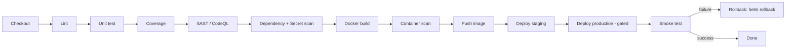

# Pipeline Stages

The reusable workflows compose into a single end-to-end delivery pipeline. A consuming
repository wires them together with a `needs:` graph (see
[`examples/app-ci-cd.yml`](../examples/app-ci-cd.yml)).

## Canonical stage order

```
Checkout
  → Lint
  → Unit test
  → Coverage
  → SAST (CodeQL)
  → Dependency scan (Trivy fs) + Secret scan (Gitleaks)
  → Docker build
  → Container scan (Trivy image)
  → Push image
  → Deploy (staging → production)
  → Smoke test
  → Rollback on failure
```

## Which workflow owns which stage

| Stage | Owning workflow | Notes |
| --- | --- | --- |
| Checkout | all | `actions/checkout@v4` |
| Lint | `python-ci` / `node-ci` / `terraform-ci` | ruff/flake8, npm lint, fmt+tflint |
| Unit test | `python-ci` / `node-ci` | matrixed |
| Coverage | `python-ci` | coverage.xml artifact (+ optional Codecov) |
| SAST | `security-scan` (CodeQL) | matrixed over languages |
| Dependency scan | `security-scan` (Trivy fs) | SARIF → Security tab |
| Secret scan | `security-scan` (Gitleaks) | full-history scan |
| Docker build | `docker-build` | Buildx + GHA layer cache |
| Container scan | `security-scan` (Trivy image) | consumes build output `image-tag` |
| Push image | `docker-build` | `push: true`, exposes tag + digest |
| Deploy | `deploy-gke` | Helm upgrade --install, OIDC auth |
| Smoke test | `deploy-gke` | retried curl of health endpoint |
| Rollback on failure | `deploy-gke` | `helm rollback` under `if: failure()` |

## Gating

- **Fan-out:** CI matrix jobs (`python-ci`, `node-ci`, CodeQL) run in parallel with
  `fail-fast: false`.
- **Fan-in:** `docker-build` `needs: ci`; `security` `needs: build`; deploys `needs`
  both build and security.
- **Approval gate:** the production `deploy-gke` job binds to a GitHub Environment whose
  required-reviewers rule pauses execution for manual approval.

## Mermaid


